# 卷积神经网络coursera笔记
***

> 终于等到coursera的卷积神经网络内容，我已经期待了2个多星期，在2017年的11月1号终于出现了，本来说是10月份底，但是一直没有等到，今天终于等到，要好好学习ng的卷积神经网络课程！

## 卷积神经网络入门

- 计算机视觉是当今社会最重要的工具之一，通过该工具，我们可以进行图片分类，目标检测以及画风格转换等等。

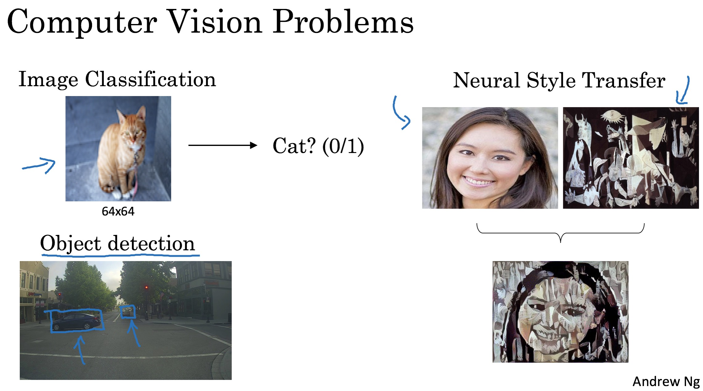

- 但是，如果使用我们之前学习的普通神经网络来进行任务的话，发现，图片维度特别大的时候，当今计算机的计算力度就显得力不从心了。

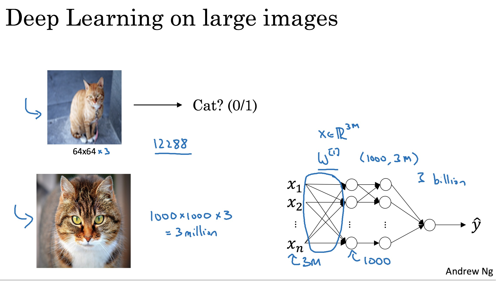

这样就引入了卷积概念。

## 卷积神经网络的本质

* 一种边缘检测机制，通过对边缘的检测来找到感兴趣的边界

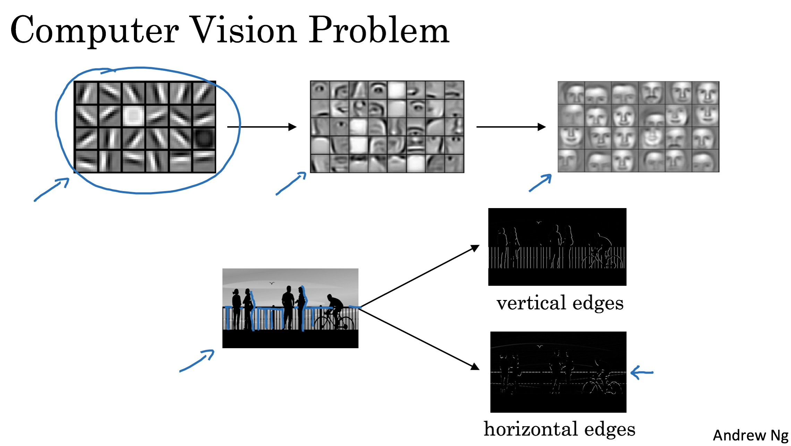

* 那么，通过核（也就是卷积核）的移动来对图像进行表达，卷积核的运算方式如下：

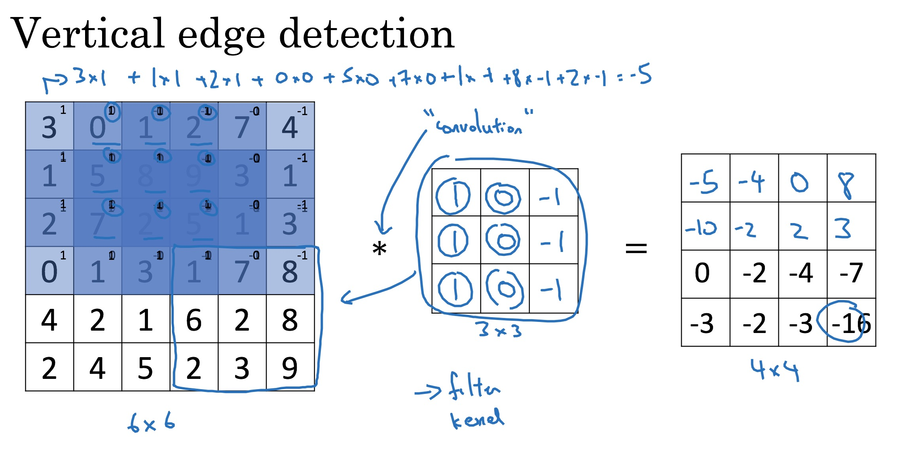

* 通过卷积核，可以放大我们所感兴趣的图片区域

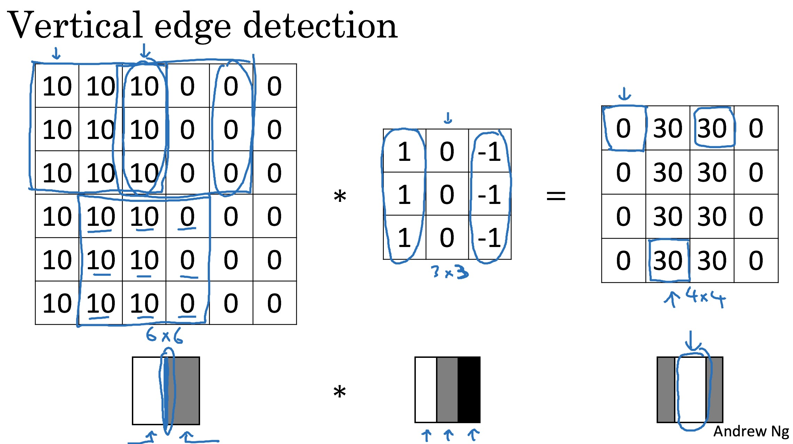

## padding操作

> 在卷积神经网络中，随着卷积核向前推进，得到的卷积运算以后，获取的特征图是越来越小，但是有些情况下，我们仅仅想获取图片的特征，而不希望特征图变小，于是，使用0填充。如下：

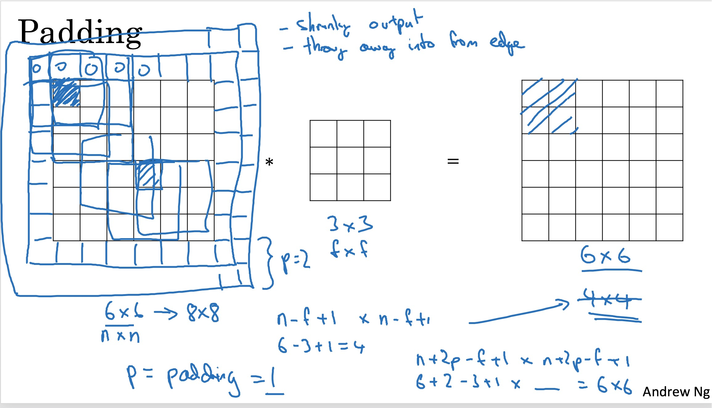

这样，就出现了两种状况，如果需要填充，我们使用padding，称之为Same，如果不需要填充，就称之为Valid。

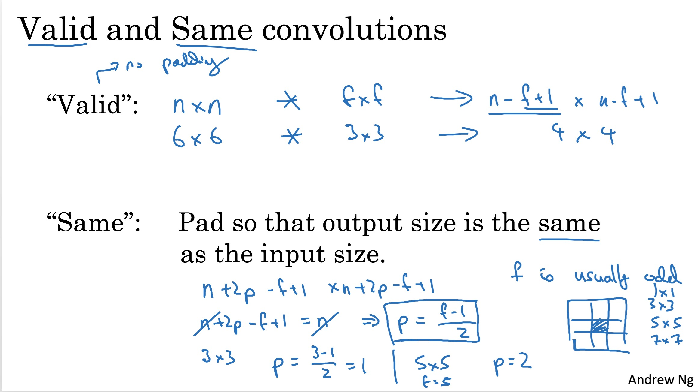

## Stride

在卷积神经网络中，卷积核移动是有步长的，因此需要指定移动的步长来进行取样。

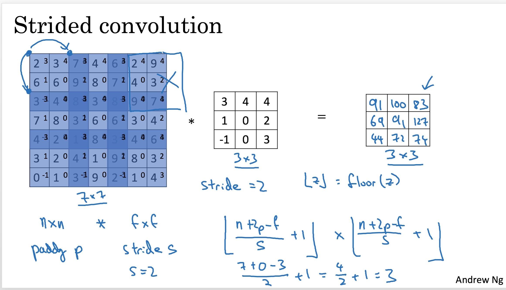

那么，卷积以后的大小为

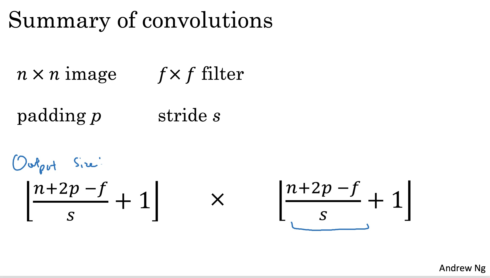

## 立体方面的卷积

在前面的介绍中，我们只介绍了平面图像的卷积，也就是二维方面的卷积，那么，对于RBG图像来说，如何实现卷积呢？

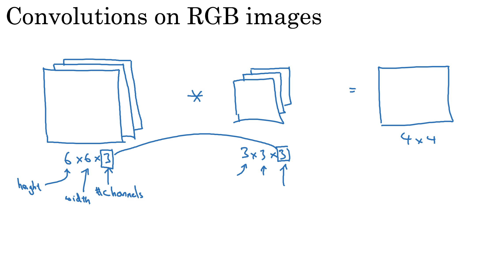

如图，可以定义3维方面的卷积，如果只有一个卷积核，那么得到的结果就是一个二维方面的图像。如果定义多个卷积核，就可以得到更多的图像特征。

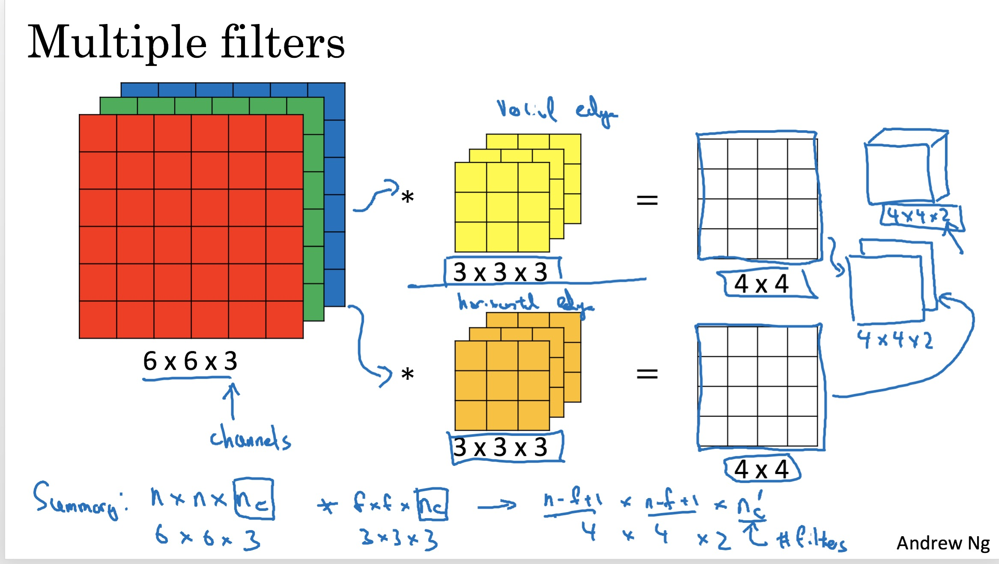

## 一个简单的卷积神经网络结构

通过对上面的介绍，我们知道了神经网络有卷积层、有padding、有stride步长，那么通过这些我们可以构建一个简单的卷积神经网络结构：

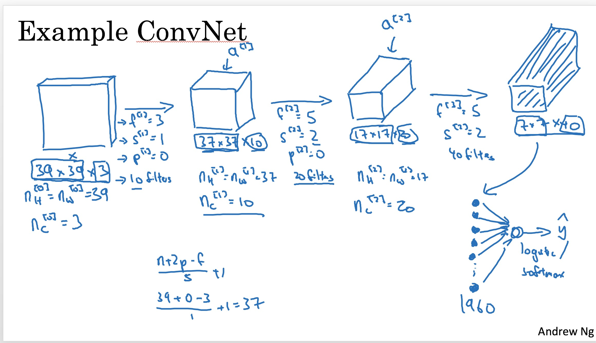

但是在这里，是没有池化这一层的，那么为什么需要池化？

> 主要防止过拟合以及减小参数

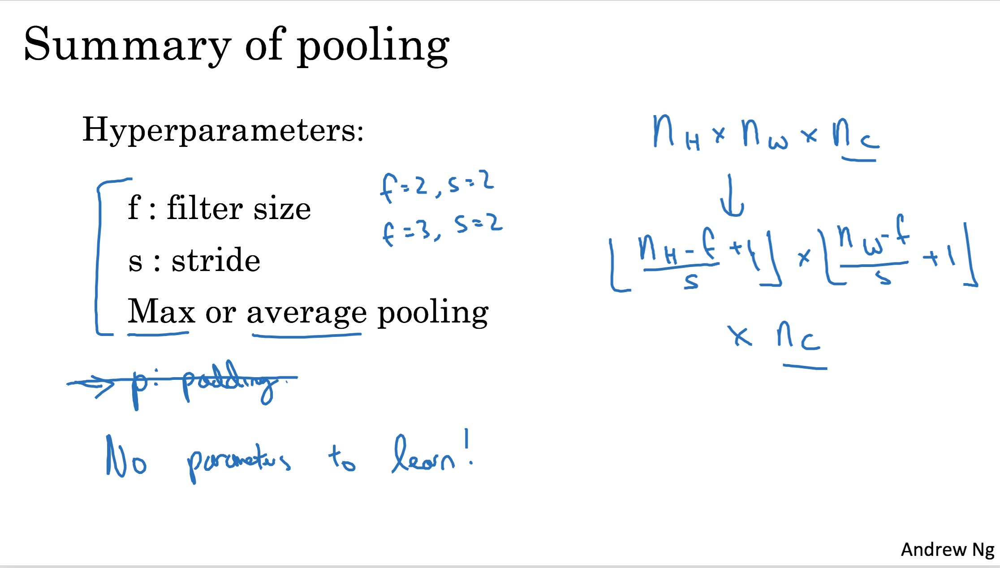

### LeNet5

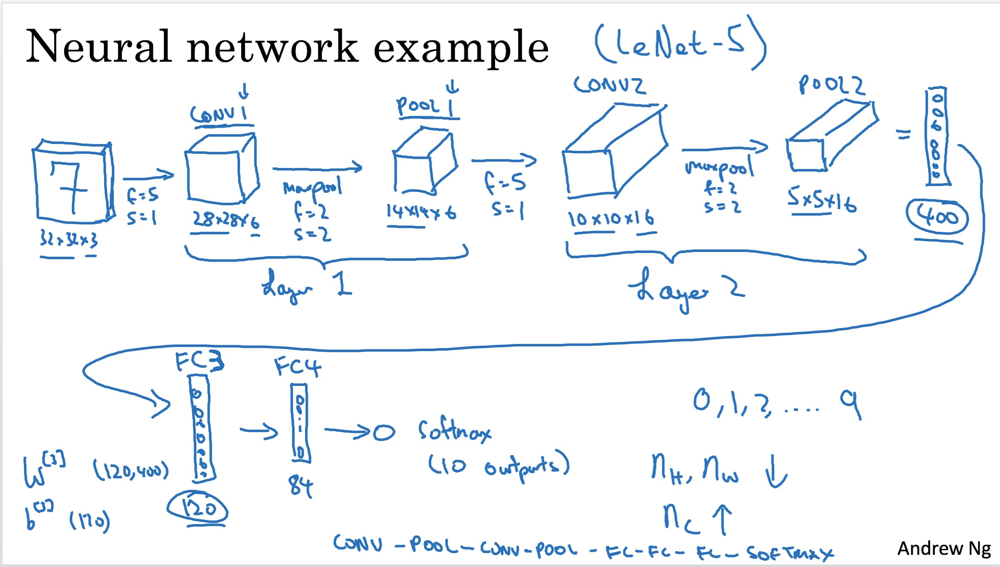

## 那么为什么使用卷积？

主要两个目的：

1. 权值共享
2. 稀疏连接，大大减少参数连接

## 这周的两个练习在该repo里，代码真的特别好，对卷积神经网络的理解又更深一步。

