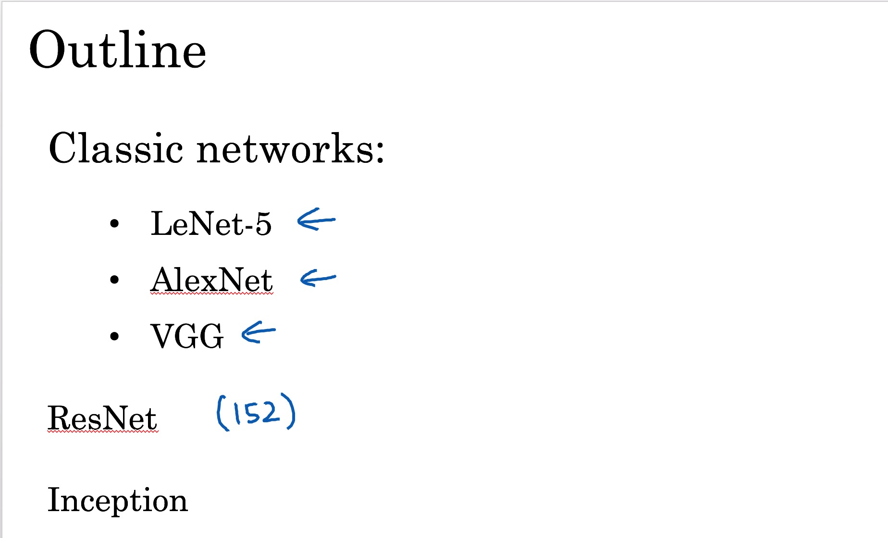
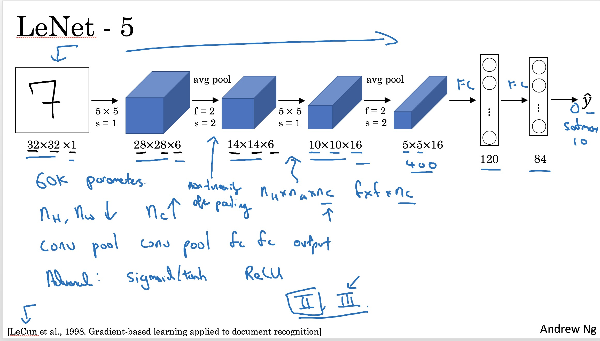
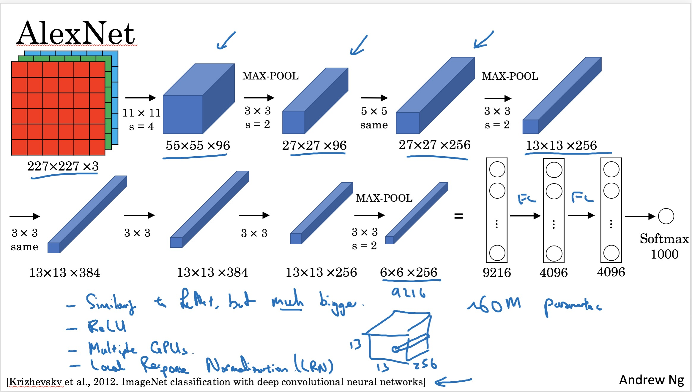
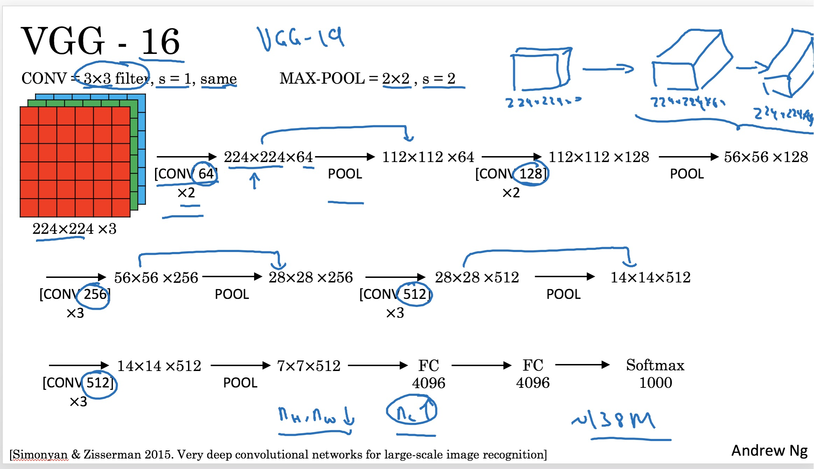
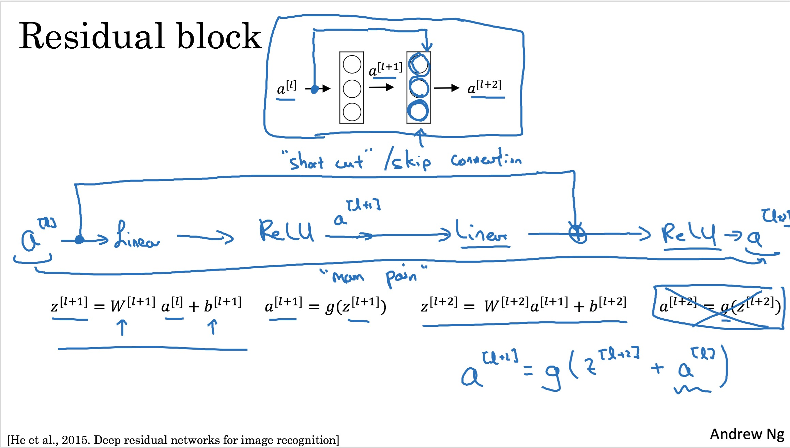
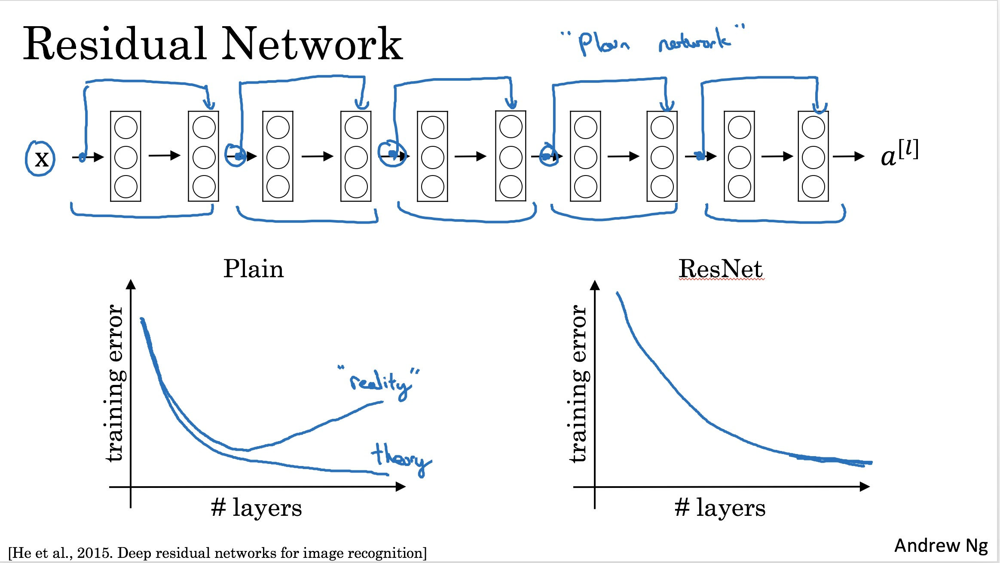
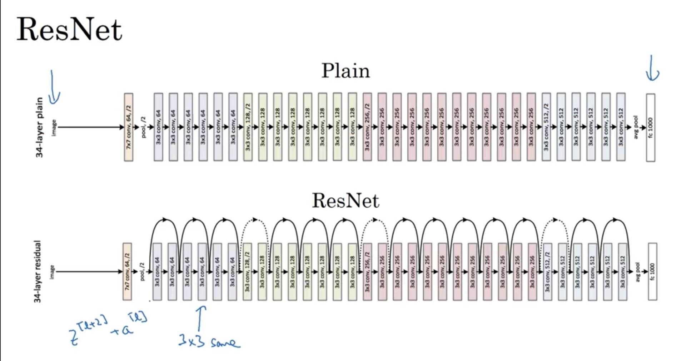
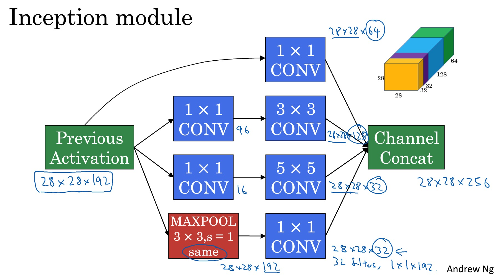
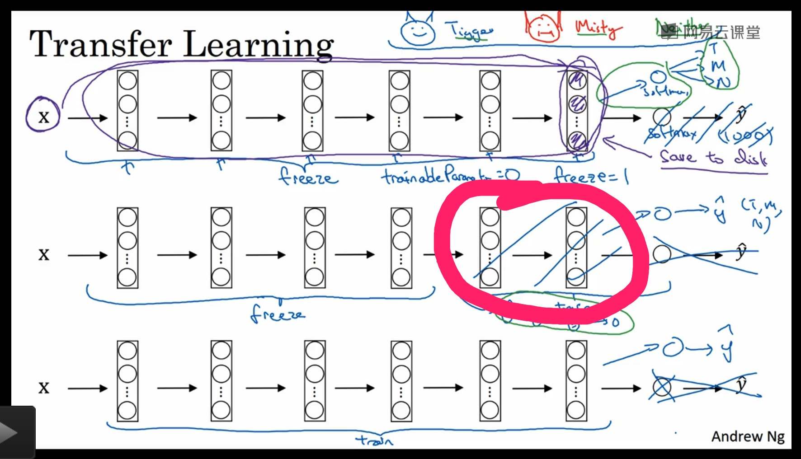

# 卷积神经网络案例研究
***

为什么要进行案例研究？

> 案例研究是非常重要的学习方式，尤其是神经网络,在第二周中，学习各种神经网络结构。

## LeNet5

这是98年提出的一种经典神经网络模型

层次网络包括

1. 卷积层
2. 池化层
3. 全连接层
4. softmax层

## AlexNet

这是Alex在12年提出的一种神经网络模型，带动了深度学习的发展：

> 这里的改变为，将以前使用的激活函数改变成了Relu。同时很多层都是卷积是不变的。

## Vgg模型

该网络更大，需要训练的时间更长。

## ResNet

> 但是，随着网络的加大，网络层数的变多，带来的问题就是梯度消失或梯度弥散，在15年，何凯明大神提出了残差网络，让更深的神经网络成为可能。

#### 那么为什么残差网络是有效的？

1. 当神经网络在某一层出现梯度消失的时候，残差网络这个时候学习的就是前面一层的参数，因此不会出现为0的情况。
2. 高阶特征和低阶特征再做融合。

### 为什么使用1x1卷积核？

1. 降低计算的维度
2. 提取高阶特征

### Inception网络
> 在某些情况下，我们不知道使用哪种卷积核是好的，因此Google提出了一种Inception网络，将各个卷积核结合起来。

### 使用开源方案

> 现在计算机界拥抱开源，因此要将自己学的东西分享出去，同时也要将自己的代码开源出去，让别人看自己的代码，同时也学习别人好的代码。

### 迁移学习

> 大家都知道训练一个非常庞大的网络是非常耗时的，因此可以将训练好的权重拿过来用，只需要改最后的输出层即可。

* 请忽略吴老大灵魂画家

### 扩充数据集

> 在深度学习中，数据量的大小直接决定了你的神经网络的表现性能。

