# 目标检测算法YOLO
***

卷积神经网络运用越来越广泛，因此大量使用在目标检测上，这一周学习目标定位与检测。

## 定位分类

> 使用卷积神经网络来输出目标的位置。

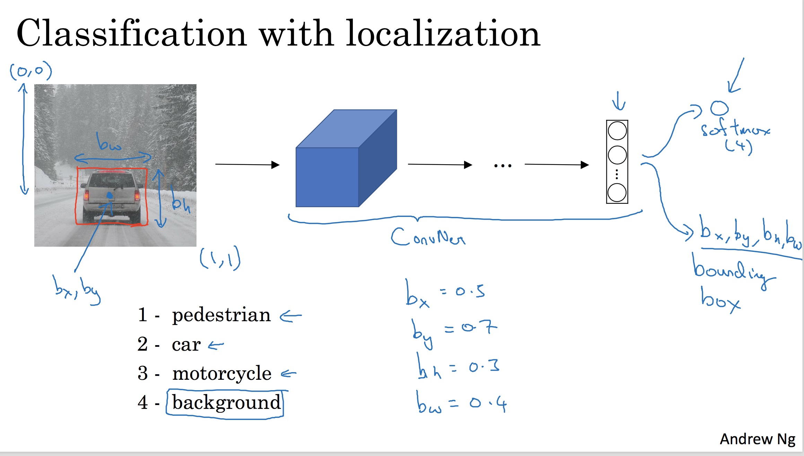

1. 首先Pc表示该对象是否为对象，如果是对象就为1，否则0
2. bx by bh bw为对象的特征点
3. c1 c2 c3为属于各个目标的概率

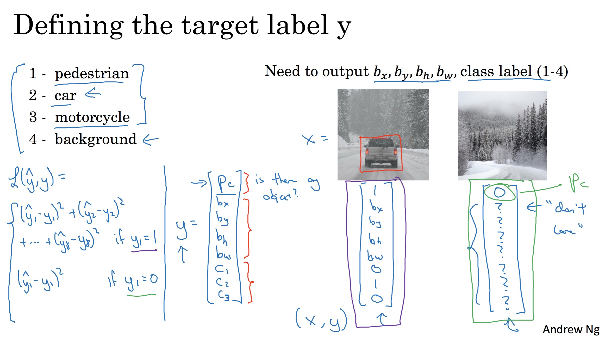

当然也可以使用特征点训练：

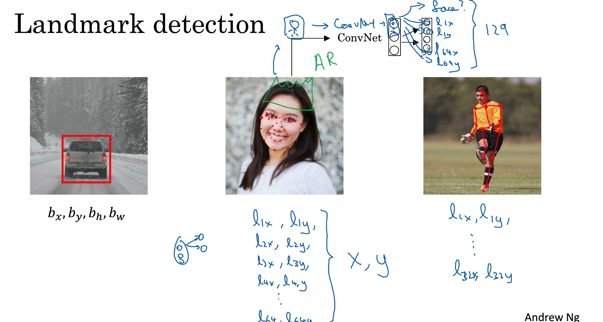

## 目标定位

一个最直接的方法就是使用滑动窗口来进行判断。
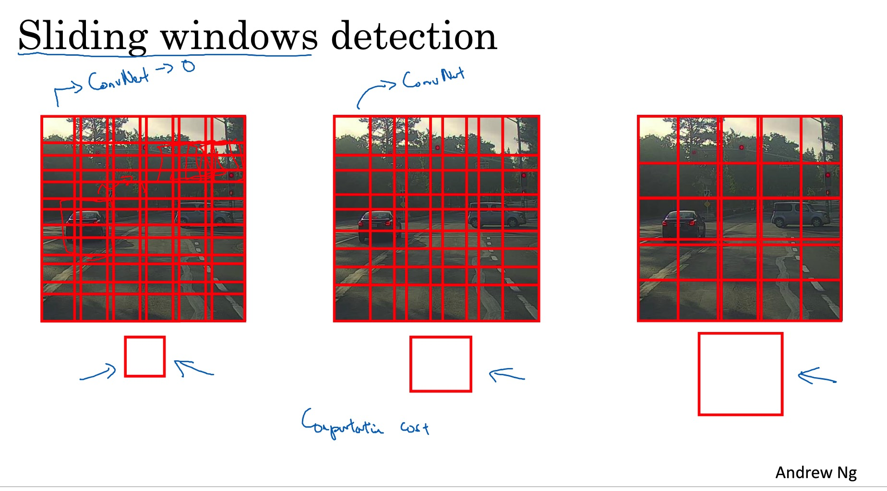

但是这样效率特别低，一个物体会被检测多次。

* 解决的办法为使用滑动卷积。
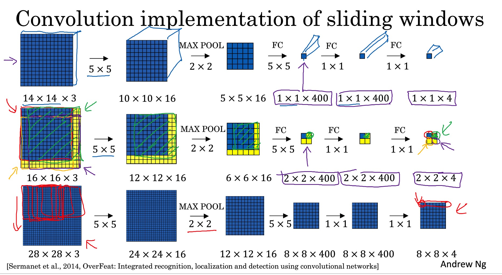

## YOLO算法

还可以使用YOLO算法。YOLO是使用网格卷积，然后使用固定的表达式来表达输出概率。
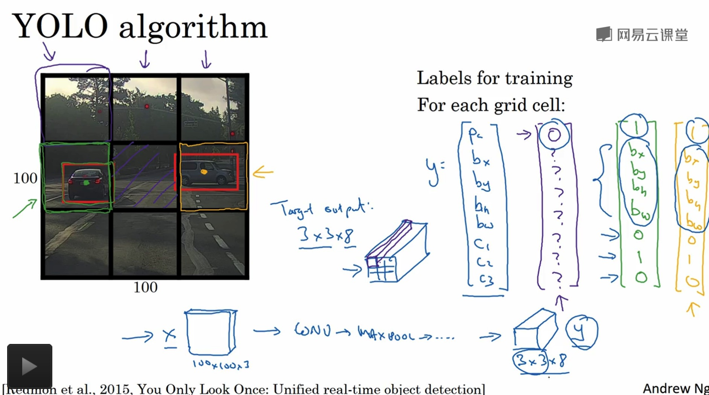

## IoU
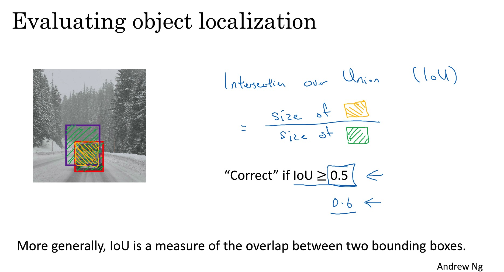

## 非极大值抑制
在使用卷积神经网络的时候，有可能对一个目标有多个检测，这个时候使用预测概率最大的。
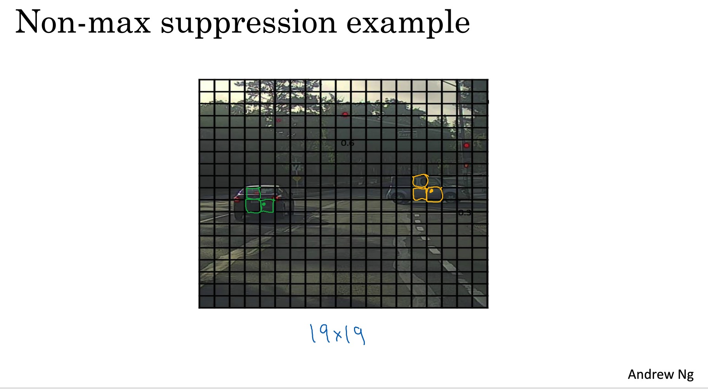

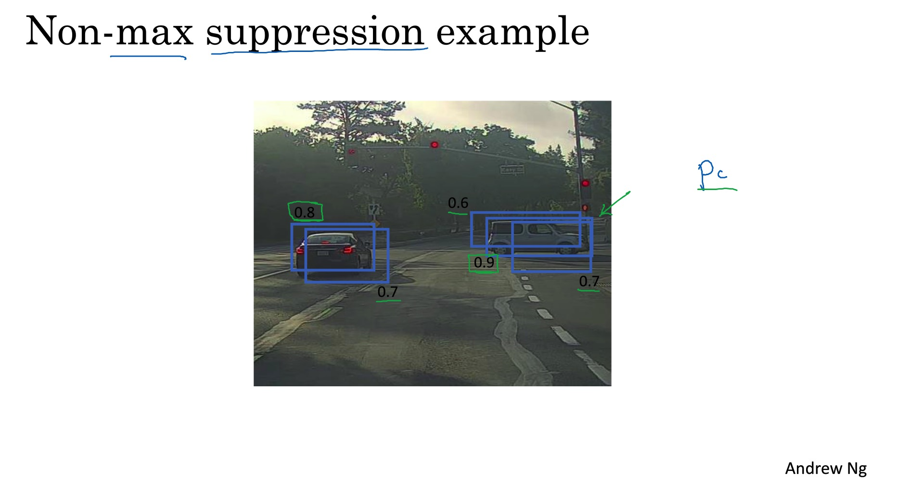

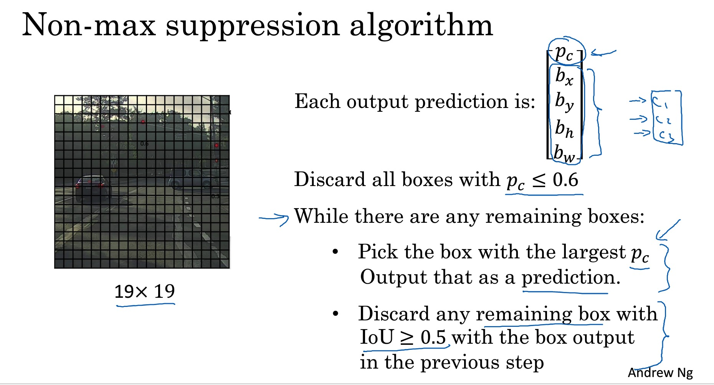

## Anchor Box
> 在进行卷积神经网络预测的过程中，可以发现很多物体都重复在一起，因此需要进行不同的检测。

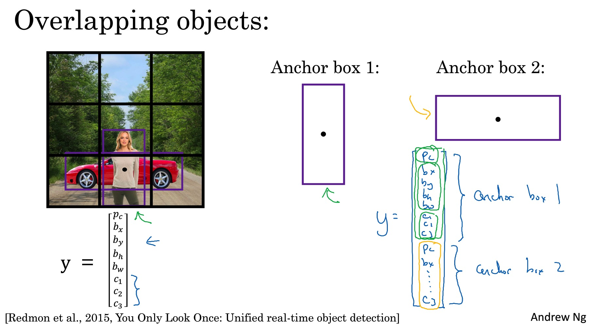

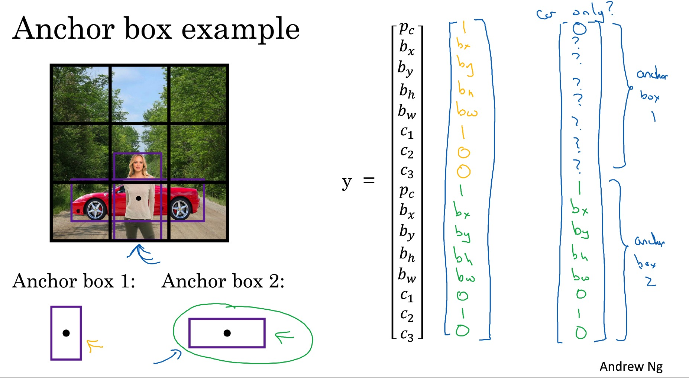

## YOLO算法

* 训练

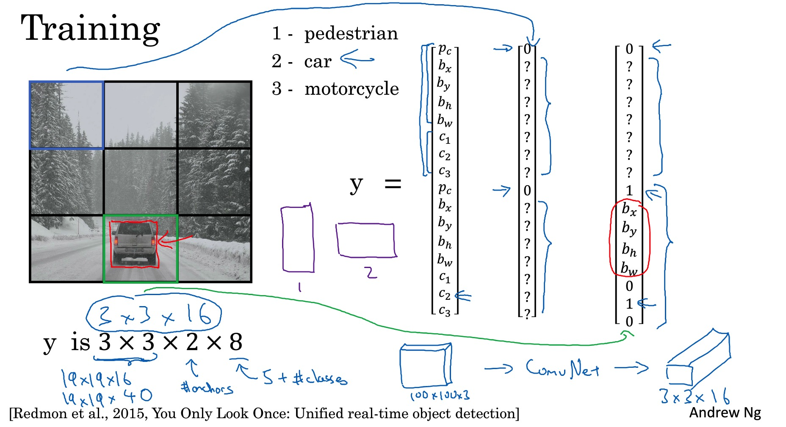

* 预测

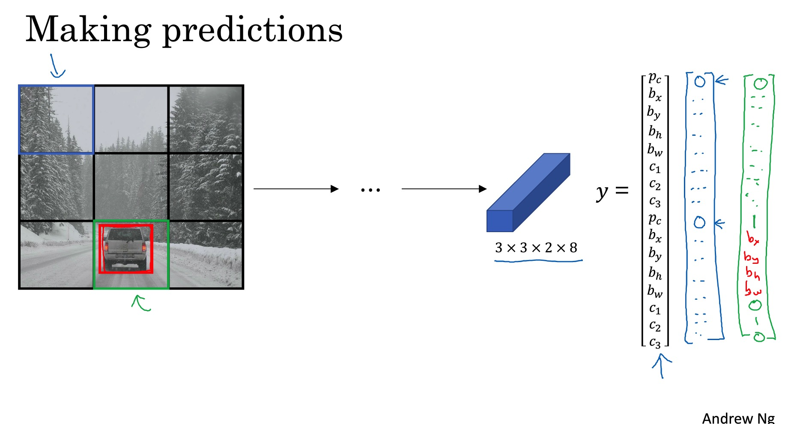

YOLO算法的细节在[YOLO](https://pjreddie.com/media/files/papers/yolo.pdf)中。

# 这一周的编程任务非常值得慢慢做！

