# 卷积神经网络week4
***
> 终于到最后一个星期了，在这个星期中，主要讲解了两个示例
* 神经网络绘画
* 人脸识别系统FaceNet

## 人脸识别系统

> 人脸识别系统有两种

* 验证(就是判断该用户是否为可行用户)
* 识别(找出该用户是哪一位)

### 在FaceNet之前，一直使用沈深度学习来训练数据，但是出现的问题就是需要大量的数据，然而现实生活中没有那么多的照片，于是Google提出了FaceNet
* [FaceNet](https://arxiv.org/abs/1503.03832)

该论文创新性地提出了一种*triplets loss*,让神经网络能够一次性学习。

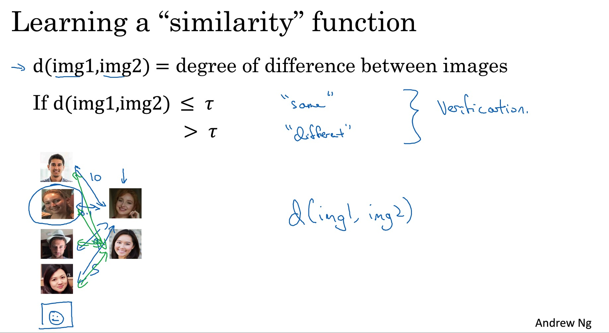

同时提出了一种网络：
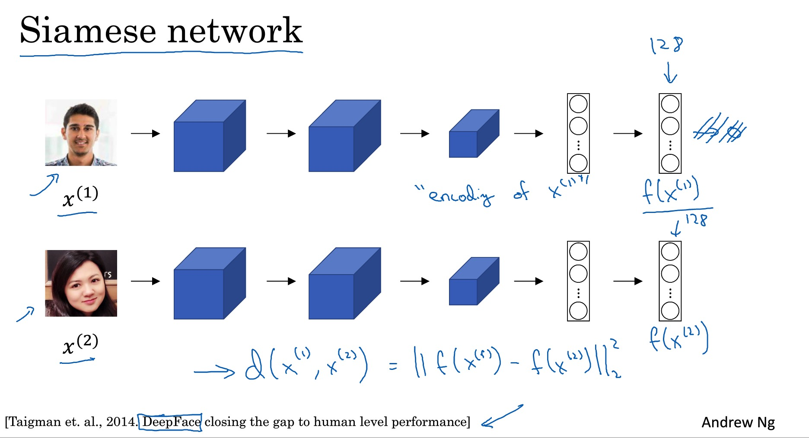

> 将图片进行编码，最后对比的是两个编码之后的距离。

如果两张图片相似，那么距离就小，否则就大。
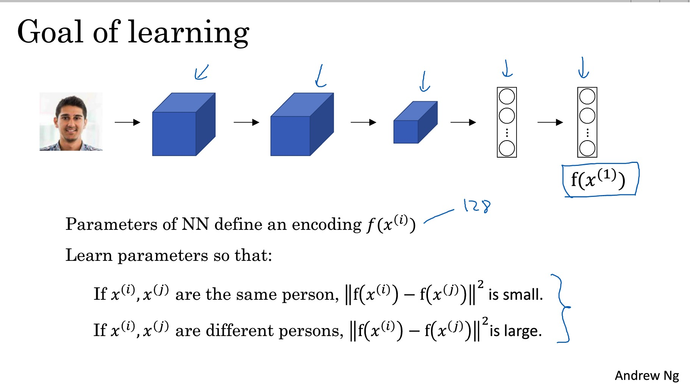

### triplets Loss

> 核心
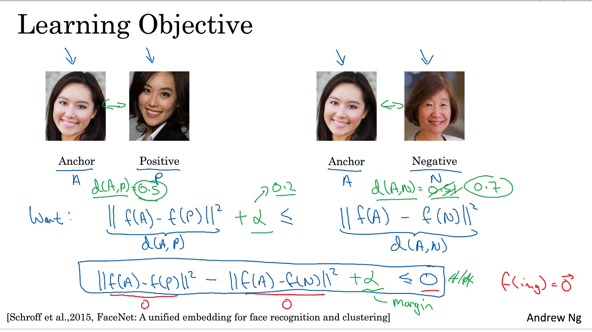

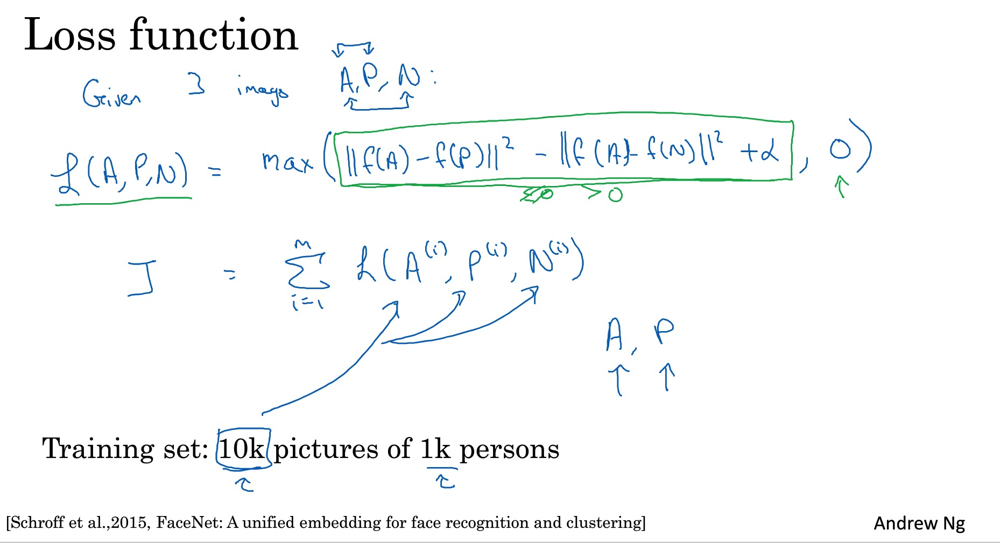

## 神经网络风格绘画

> 让计算机来画画这是非常有意思的一件事情，当今随着GAN的兴起，让计算机帮助创作已经成为可能。
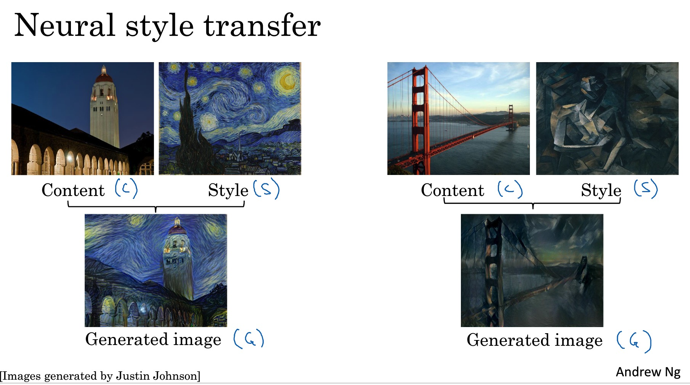

### 深度卷机神经网络

> 在卷积神经网络中，通过训练神经网络，在中间的一些隐藏层中，我们可以发现找到特征，通过神经网络来提取特征，并可视化。
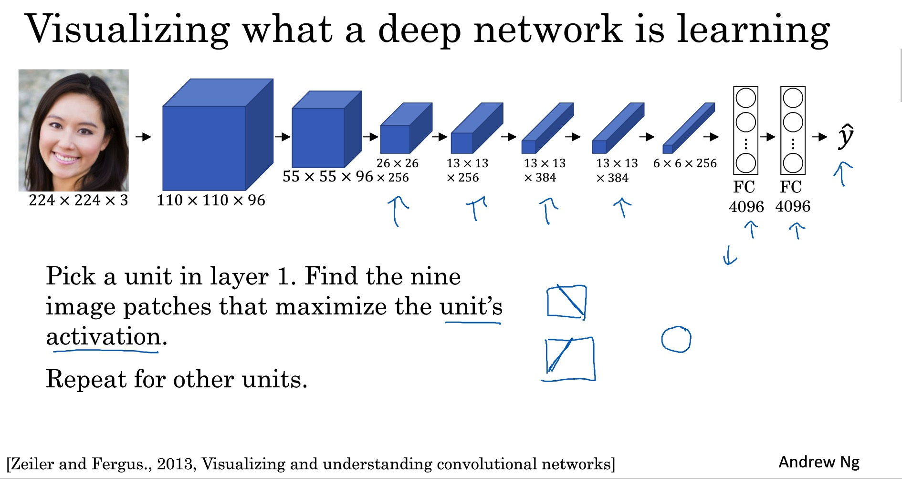

[Visualizing and Understanding Convolutional Networks](https://arxiv.org/abs/1311.2901)
这篇论文特别有意思，将中间节点可视化出来。

### 代价函数

> 该代价函数由两个部分构成

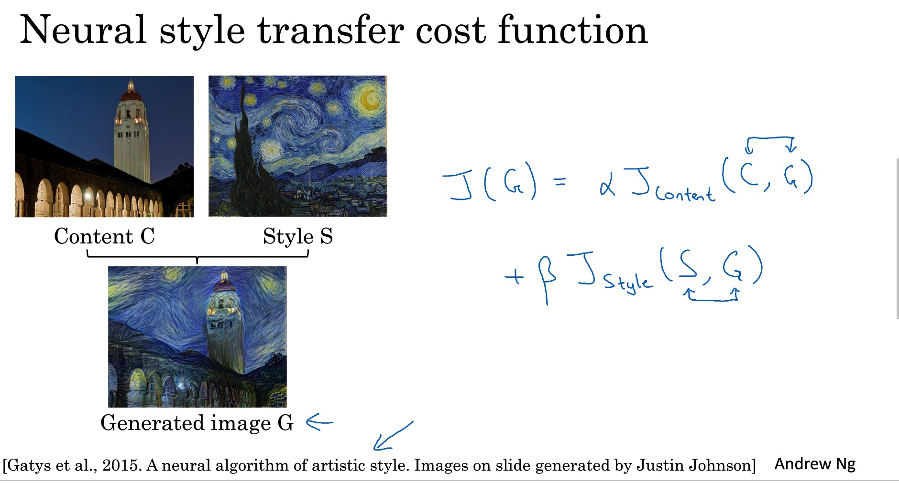

* 内容代价函数

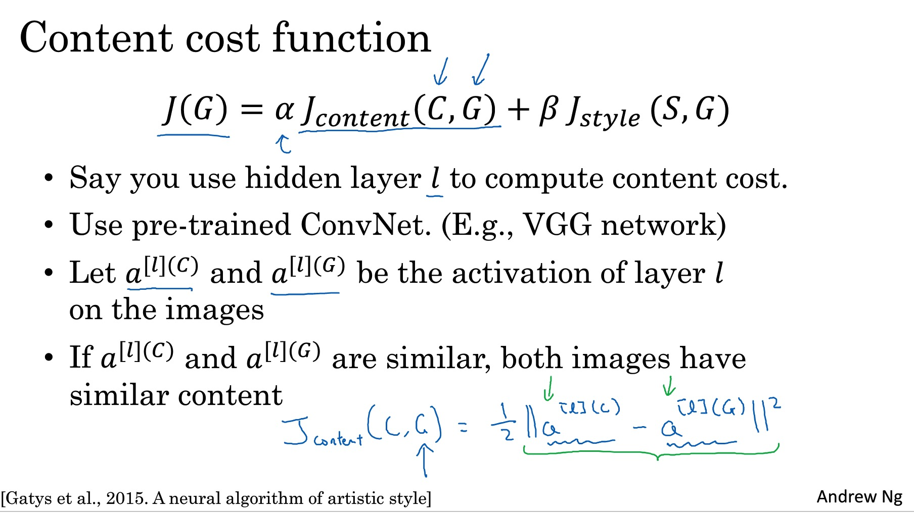

* 风格代价函数(Gram矩阵)

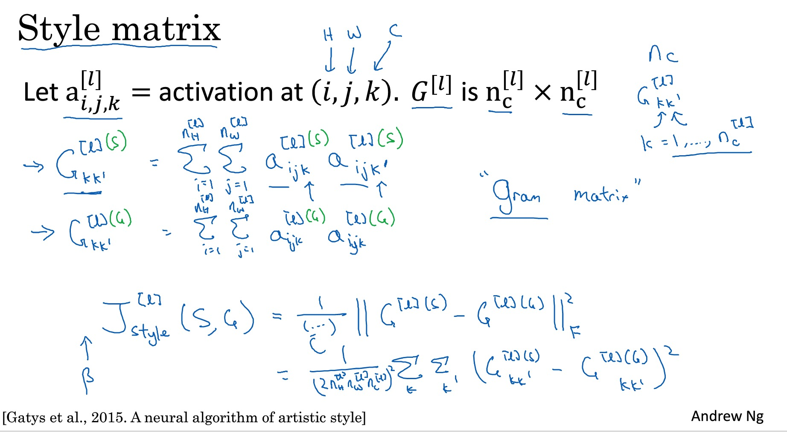

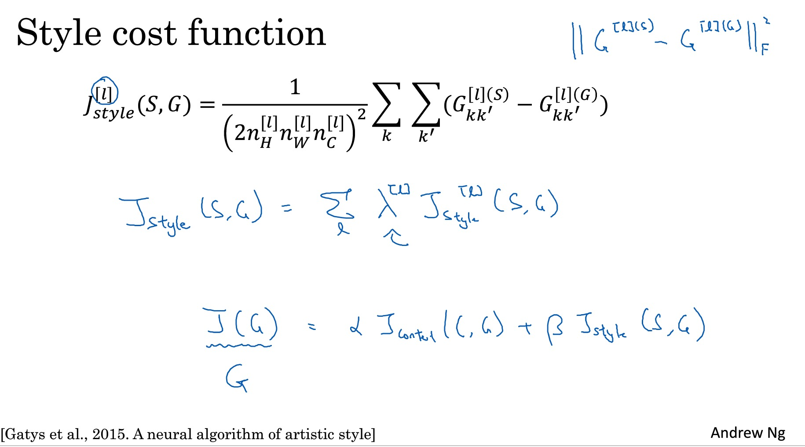

## 到这里，整个卷积神经网络就结束了，当然了，吴老大还讲解了一维 三维方面的卷积。

> 整个卷积神经网络学的特别开心，吴恩达大佬的水平就是不一样，让我理解了卷积的作用，以及各种神经网络应用。

