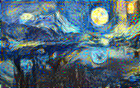
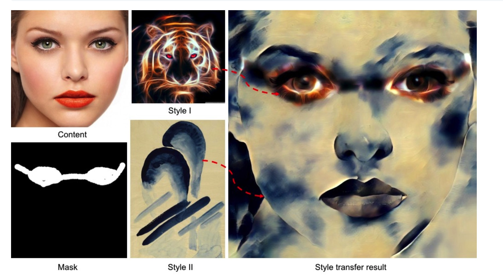

# 神经网络绘画 pytorch实现

* 论文在此[A Neural Algorithm of Artistic Style](https://arxiv.org/abs/1508.06576)

> 学习这篇论文也花了我很长的一段时间，从看Ng的课程到到看各种框架的实现，Ng的课程是使用keras框架的，我使用的Pytorch框架，pytorch框架代码非常优美，完全的pythonic风格。下面就是我学习这篇论文的点滴。

## 什么是神经网络绘画？
2015年，Leno A. Gatys等人提出了一种神经网络绘画，这是一种让计算机来模拟作家绘画，比如这样的，将梵高的星空风格映射到另一张图片上。

原图是这样的


想要的风格是这样的


得到的效果是这样的



如上所示，这就让计算机来模拟人的风格绘画。今年2017年NIPS中，又出现了一篇特别有意思的论文[UniversalStyleTransfer](https://arxiv.org/pdf/1705.08086.pdf)

,可以实现区域风格化，有时间可以看看这篇论文。

## 神经网络应用绘画
那么，如何来生成一张这样的图片呢？根据论文的介绍，首先生成一张随机图像G，然后定义两种损失函数LC以及LS。LC是G与C(内容图像)的差距，这里的LC采用训练好的VGG模型来提取特征比对。LS则采用通道之间的关联系数来定义损失。

## 具体实现

在论文中，定义LS是通过Gram矩阵来实现。

```
class GramMatrix(nn.Module):
    def forward(self,input):
        # b=1
        b, c, h, w = input.size()
        f = input.view(b,c,h*w)
        G = torch.bmm(f,f.transpose(1,2)) # batch 矩阵之间乘法
        # return G.div_(h*w)
        return G.div_(b*c*h*w)
```

那么定义Style与Generate图之间的差距
```
class styleLoss(nn.Module):
    def forward(self,input,target):
        GramInput = GramMatrix()(input)
        return nn.MSELoss()(GramInput,target)
```

而内容损失则为
```
contentLosses = [nn.MSELoss()] * len(content_layers)
```

将两种损失使用加权叠加起来就实现了Loss。

```
loss_layers = style_layers + content_layers
```
在Pytorch中，定义了模型之后，反向传播是自动的，因此非常方便。

